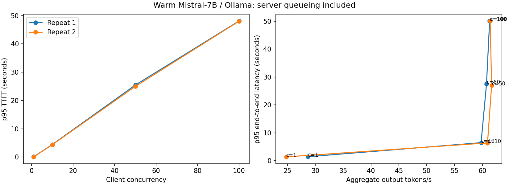

# Verified free Colab T4 serving experiment

Run exported 8 October 2026; receipts validated 9 October. **800/800 warm requests succeeded; zero failures.** Mistral-7B-Instruct-v0.3 Q4_K_M, Ollama 0.40.1, one Tesla T4. All 33/33 layers offloaded to GPU. Context 2048; four server decoding slots; 32 output tokens per request. Two repetitions of 100 fixed prompts per client-concurrency level.

| Client concurrency | Aggregate output tokens/s | TTFT p95 (s) | End-to-end p95 (s) |
|---:|---:|---:|---:|
| 1 | 24.756–28.678 | 0.067–0.104 | 1.374–1.425 |
| 10 | 59.776–60.928 | 4.358–4.442 | 6.363–6.467 |
| 50 | 60.748–61.669 | 24.971–25.462 | 26.927–27.474 |
| 100 | 61.312–61.406 | 48.042–48.124 | 50.034–50.064 |

Ranges are the two separate run summaries, not pooled percentiles. Throughput saturates near 60–62 output tokens/s at concurrency 10; larger queues primarily increase waiting. At concurrency 100, p95 TTFT is about 48 seconds and p95 response completion about 50 seconds. A larger client queue is not higher active GPU decoding parallelism.

**Cold start:** first content at 90.349 seconds, completion at 91.190 seconds. Warm timings exclude this initialization. Fixed prompt reuse permits cache effects. No long-output or production SLO guarantee is inferred.



## Evidence and reproducibility

- `report.json`, eight `c*-r*.json` files and `prompts.json`: exported workload and per-request timing/token receipts. Aggregate throughput and p50/p95 recomputed by `notebooks/validate_serving_archive.py`.
- `cold-start.json`: separate initialization receipt.
- `gpu-server-evidence.txt`: selected original log lines confirming GPU buffers/offload. Original log contains 804 successful generate HTTP responses: 800 measured + three warmups + one cold.
- `install-receipt.json`: official package checksum and local-prefix installation receipt. Temporary signed download query parameters removed from published receipts; measurements unchanged.
- `validation.json`: archive hash, source commit and validation limitations.

Measured source commit: `fd760080b270a3f9d70adfb02f1c8219686c756b`. Original ZIP SHA256: `d9a87ae916c92cae0d338aacac05cc8a3a753fc5b5d0c276f14e893645062c1f`. The full 20 MB server log remains in the original private ZIP; only relevant lines are published.

Timing values are exported client measurements, not independently replayed clocks. TTFT means first nonempty content chunk; server eval_count supplies token counts, not chunk counts. Raw engine eval durations and generated text were not exported, so engine TPS and text quality cannot be independently reconstructed. Closed-loop worker concurrency is not an open-loop traffic test. No vLLM/TensorRT comparison, AWQ conversion or model-quality improvement is claimed.

Validate your retained archive:

```sh
python notebooks/validate_serving_archive.py /path/to/serving-experiment.zip --output results/colab-t4
```
